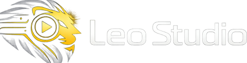

<p align="center">
  
</p>

<p align="center">
  <strong>Leo Studio Generator</strong><br>
  Apple Silicon에서 돌아가는 로컬 생성 스튜디오.<br>
  MLX. 클라우드 없음. API 키 없음. 프롬프트와 파일은 Mac 밖으로 나가지 않습니다.
</p>

<p align="center">
  <a href="https://github.com/suyaleo/Leo_Studio_Generator">github.com/suyaleo/Leo_Studio_Generator</a>
  ·
  upstream <a href="https://github.com/mrbizarro/phosphene">mrbizarro/phosphene</a>
</p>

**현재 기반: Phosphene v4.15.1.** 이 저장소는 [Phosphene](https://github.com/mrbizarro/phosphene)을 포크한 Leo Studio 빌드입니다. 패널 UI는 한국어, 로컬 패널은 `http://127.0.0.1:8198`입니다. 이후 방향은 **Swift 네이티브 Mac 앱**입니다.

MIT licensed.

## 이 포크에서 달라진 점

- 패널 브랜드: **Leo Studio**
- 워크플로 탭·문서·주요 폼 **한글화**
- 편집 탭: 시퀀스가 없으면 **새 시퀀스**를 만들고, 미디어 풀 `+`로 클립을 바로 올림
- 헤더 메모리 칩 `61%61%` 중복 표시 제거
- 모델 카드 `모델 관리` 링크 중복 제거
- 오디오 탭 `신규` 배지 제거
- 세로 영상 플레이어 오버레이 한글 겹침 수정
- 편집 탭 선택 시 왼쪽 메뉴 간격이 흔들리지 않도록 레이아웃 고정

생성 엔진·가중치·HTTP API는 upstream Phosphene과 같습니다. 전체 기능 설명은 [README.phosphene.md](README.phosphene.md)를 보세요.

## 개요

Leo Studio는 Apple Silicon용 로컬 생성 패널입니다. 영상 엔진 두 개가 동등합니다.

| 엔진 | 하는 일 | 가중치 |
|---|---|---|
| **LTX-Video 2.5** | 텍스트/이미지/키프레임/연장/캐릭터, Audio → Video | 베이스 ~27.5 GB, Q8 추가 ~30 GB |
| **Hailuo H3** | 대사·사운드가 붙은 영상 | ~75 GB |
| **YuE2** | Audio → 작곡 (가사+스타일) | ~11 GB |

스틸은 Qwen-Image-Edit, 캐릭터는 패널 안에서 LoRA 학습(얼굴+음성). 전부 온디바이스입니다.

패널은 RAM에 맞춰 표면을 접습니다. 48 GB 미만은 텍스트/이미지 투 비디오와 이미지 탭. 48 GB 이상에서 캐릭터, FFLF, 연장, Q8. 120 GB+는 크기 제한 없음.

## 실행 (로컬)

Pinokio 없이 이 체크아웃에서:

```bash
git clone https://github.com/suyaleo/Leo_Studio_Generator.git
cd Leo_Studio_Generator
./run_panel.sh          # 포그라운드
./run_panel.sh --bg     # 백그라운드, panel.log
# open http://127.0.0.1:8198
```

Python 3.11 venv는 `ltx-2-mlx/env`입니다. 설치·패치·가중치 받기는 upstream과 같습니다. 자세한 수동 설치는 [Phosphene README](https://github.com/mrbizarro/phosphene#install)를 따릅니다. Pinokio Discover URL만 이 저장소로 바꾸면 됩니다:

```
https://github.com/suyaleo/Leo_Studio_Generator
```

패널 HTTP API는 루프백 전용입니다. `POST /queue/add`, `GET /status`, `GET /outputs`. 인증 없음.

## 탭

| 탭 | 역할 |
|---|---|
| 영상 | T2V, I2V, 캐릭터, FFLF, 키프레임, 연장, 리믹스 |
| 원샷 | 자르지 않는 30초~2분 샷 |
| 이미지 | Qwen / HiDream / Ideogram 스틸 |
| 스토리보드 | 기획 → 샷 → 컷 |
| 편집 | 타임라인. 생성물 풀에서 시퀀스를 만듦 |
| 오디오 | 작곡(YuE2) / 트랙으로 영상 구동 |
| 학습 | 캐릭터·스타일 LoRA |

## 하드웨어

Apple Silicon only. MLX는 Apple 전용입니다.

| RAM | 티어 |
|---|---|
| 48 GB 미만 | Compact (Q4) |
| 48–79 GB | Comfortable (Q8 표면) |
| 80–119 GB | Roomy |
| 120 GB+ | Studio |

## 앞으로

1. 이 패널을 Leo Studio Generator의 엔진 런타임으로 유지
2. Swift Mac 앱이 같은 로컬 엔진을 호출하는 UI가 됨
3. 웹 패널의 한글 워크플로(영상·편집·원샷)를 네이티브로 옮김

## 라이선스

[MIT](LICENSE).

원본 Phosphene은 Mr. Bizarro의 MIT 코드입니다. Leo Studio 변경(브랜드, 한글 UI, 편집/레이아웃 수정)도 MIT입니다. 모델 가중치는 각 벤더 라이선스(`LICENSES/`)를 따릅니다.

## Credits

- [Phosphene](https://github.com/mrbizarro/phosphene) — Mr. Bizarro
- [LTX-Video](https://github.com/Lightricks/LTX-Video) — Lightricks
- Hailuo H3 — MiniMax
- YuE2 — Multimodal Art Projection, MLX port by vanch007
